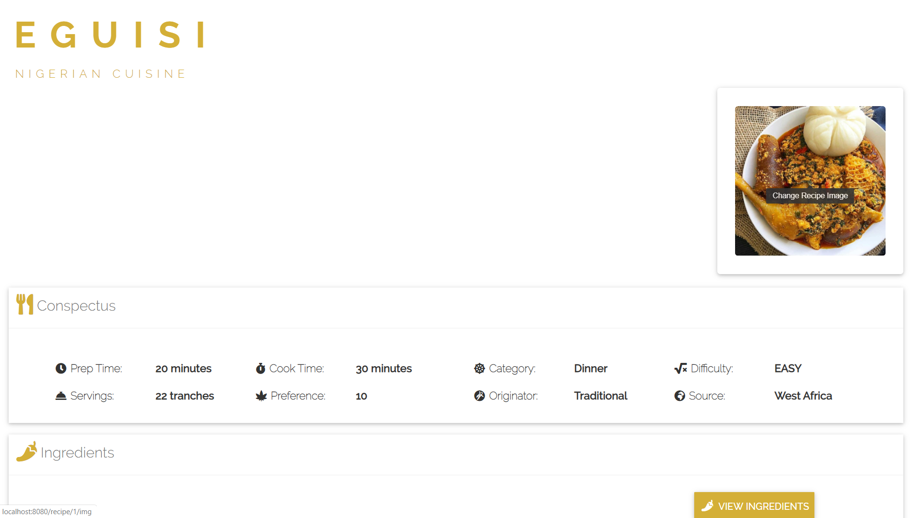
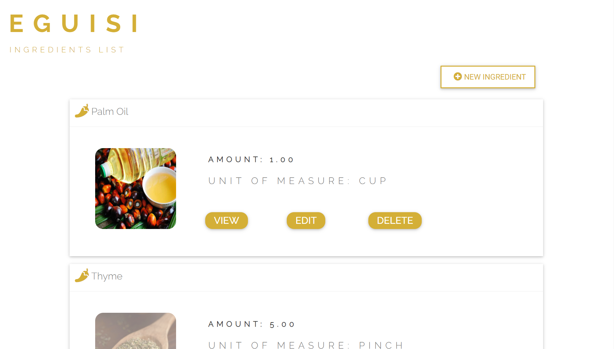

# Ambrosia \ am-ˈbrō-zh(ē-)ə \
## Ambrosia Cookery Book: Recipe Management System (Spring MVC)

### Overview

Ambrosia is a lightweight eCookery Book/Recipe Management System designed to be a nifty smart home iteration of the traditional Cookbook.
Using Docker containers for speedy and easy cloud deployment, the objective functionality is to proffer an extensible IoT tool for the modern abode to curate culinary recipes in an interactive "data-driven" manner.
The application architecture design is in adherence to the MVC (Model-View-Controller) approach and Repository Pattern; with an emphasis on the separation of the respective layers for the additional benefit of long-term scalability, seamless modification and testing.
On the front-end, a diligent BEM:Block Element Modifier approach was utilized for a clean style theme that can be promptly modified per application deployment instance.   
  
Continuous development goals include but aren't limited to implementing social-share feature, RESTful API Service, recommendation-based Tensor Flow ML functionality as well as a mobile client app.
  
Built using using Java, Spring, Spring Boot, Thymeleaf, Material Design, Hibernate, Java Persistence API, H2 DBMS, PostgreSQL, Mongo DB and Circle CI for CI/CD pipeline. 
  

## Related Links

**Portfolio URL >_** https://www.emekaegwim.com/portfolios/ambrosia/

**App URL >_** TBD

## Setup
&nbsp;
## System Requirements
&nbsp;
## Installation

### Deployment

  

&nbsp;

&nbsp;  

